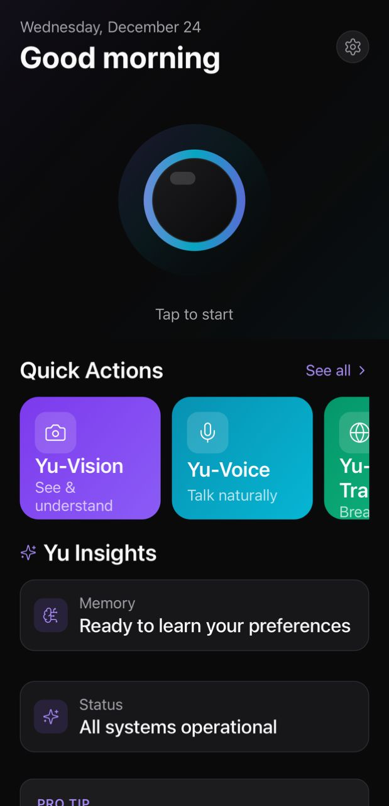
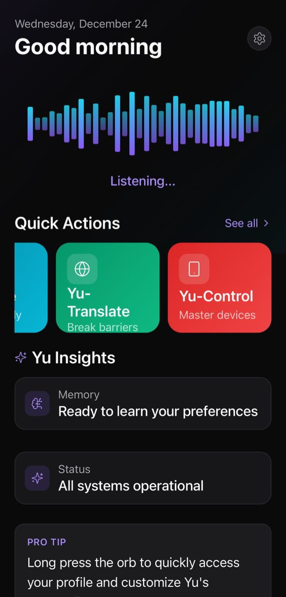
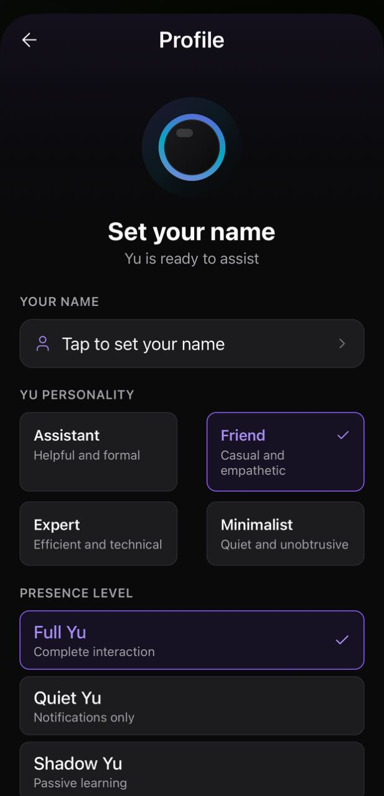
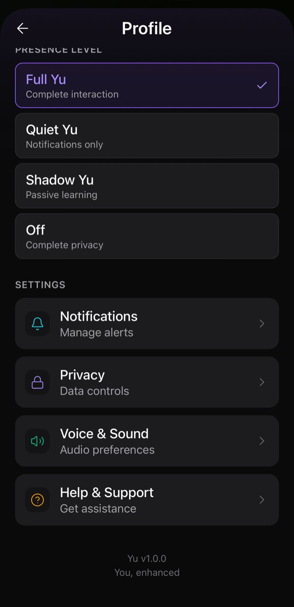
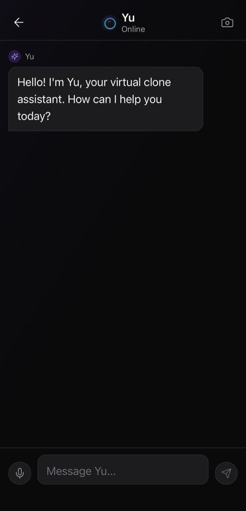
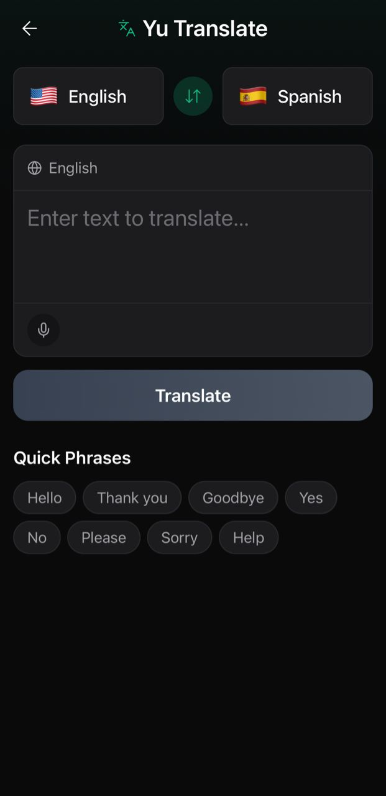
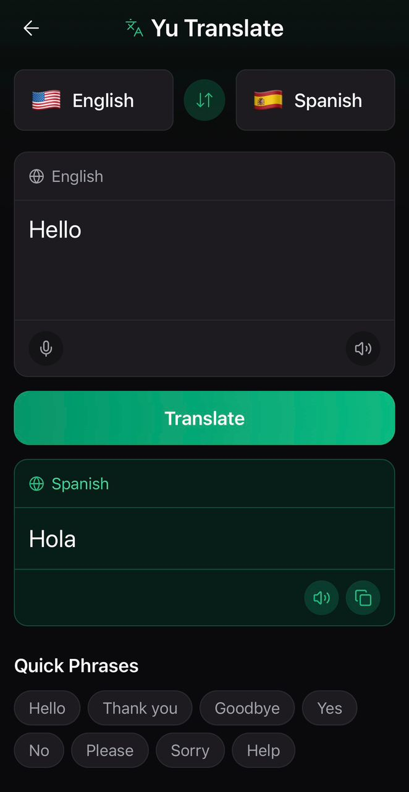
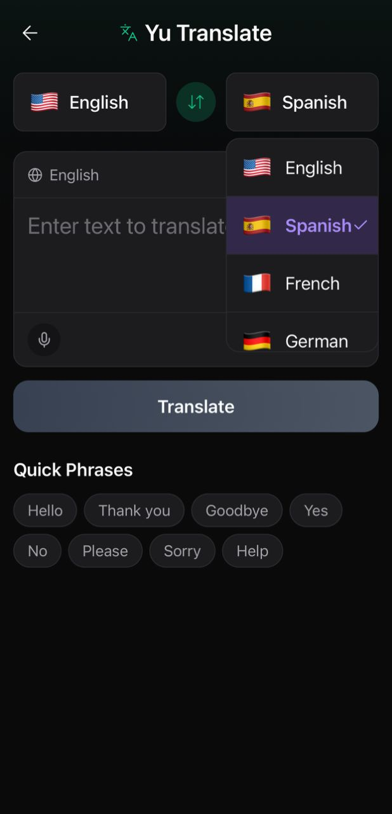
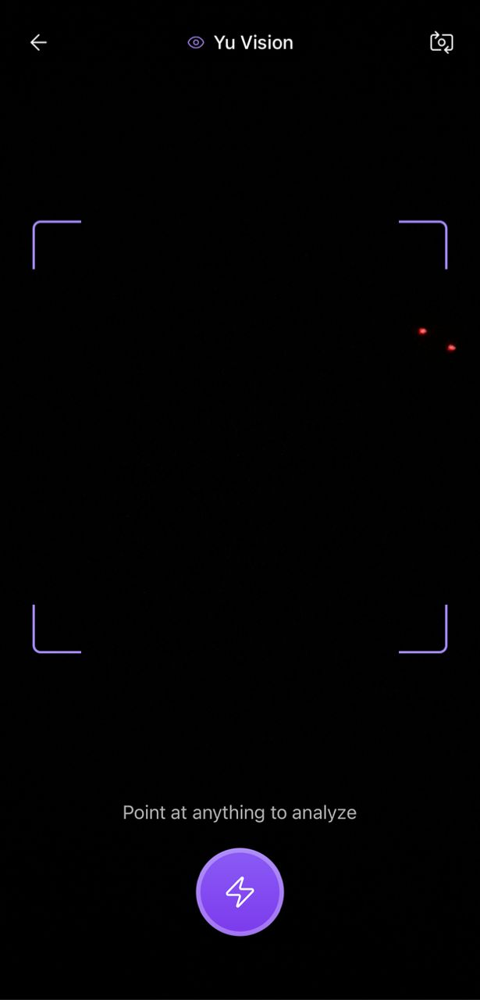

# Yu Assistant - Application Documentation

## Overview

**Yu: Your Virtual Clone Assistant** is a React Native mobile application that serves as a personal AI assistant with capabilities in vision, voice, translation, and device control.

## Table of Contents

1. [Getting Started](#getting-started)
2. [Application Structure](#application-structure)
3. [User Guide](#user-guide)
4. [Development Guide](#development-guide)
5. [Configuration](#configuration)
6. [Troubleshooting](#troubleshooting)

---

## Getting Started

### Prerequisites

- Node.js 18+ installed
- npm or yarn package manager
- Expo CLI installed globally: `npm install -g expo-cli`
- Expo Go app installed on iOS/Android device (for testing)
- TypeScript knowledge (recommended)

### Installation

1. **Clone the repository**
   ```bash
   git clone <repository-url>
   cd Yu
   ```

2. **Install dependencies**
   ```bash
   npm install
   ```

3. **Start the development server**
   ```bash
   npm start
   ```

4. **Run on device**
   - Scan QR code with Expo Go app (iOS/Android)
   - Or press `i` for iOS simulator, `a` for Android emulator

### Available Scripts

```bash
# Start development server
npm start

# Start with cache cleared
npm start:clean

# Run on Android
npm run android

# Run on iOS
npm run ios

# Run on Web
npm run web

# Run tests
npm test

# Lint code
npm run lint
```

---

## Application Structure

```
Yu/
├── src/
│   ├── screens/          # Screen components
│   │   ├── HomeScreen.tsx
│   │   ├── ProfileScreen.tsx
│   │   ├── ProfileSetupScreen.tsx
│   │   ├── ChatScreen.tsx
│   │   ├── TranslateScreen.tsx
│   │   └── YuVisionScreen.tsx
│   ├── components/       # Reusable components
│   │   ├── YuOrb.tsx
│   │   └── AudioVisualization.tsx
│   ├── theme/            # Theme configuration
│   │   ├── colors.ts
│   │   ├── typography.ts
│   │   └── index.ts
│   └── utils/            # Utility functions
│       └── speech.ts
├── assets/               # Images, fonts, etc.
├── docs/                  # Documentation
├── App.tsx               # Main app component
├── index.js              # Entry point
├── package.json          # Dependencies
├── tsconfig.json         # TypeScript config
├── babel.config.js       # Babel config
└── metro.config.js       # Metro bundler config
```

---

## User Guide

### Home Screen

The Home Screen is your main interaction hub.
<br>
 <br>
#### Features:
- **Yu Orb**: Tap to start listening, long press for profile
- **Quick Actions**: Access Yu-Vision, Yu-Voice, Yu-Translate, Yu-Control
- **Listening Mode**: Tap the orb to activate voice input
- **Responses**: Yu responds with voice and text


#### How to Use:
1. Tap the Yu Orb to start listening
2. Wait for the 3-second listening period
3. Yu will respond with voice and text
4. Use quick action cards to navigate to specific features

### Profile Screen

Customize your Yu experience. <br>


#### Features:
- **Name Setup**: Set your name for personalization
- **Personality Selection**: Choose how Yu communicates
  - Assistant: Formal and helpful
  - Friend: Casual and empathetic
  - Expert: Technical and efficient
  - Minimalist: Quiet and unobtrusive
- **Presence Level**: Control Yu's activity level
  - Full Yu: Complete interaction
  - Quiet Yu: Notifications only
  - Shadow Yu: Passive learning
  - Off: Complete privacy
- **Settings**: Access notifications, privacy, voice, and help

#### How to Use:
1. Long press the Yu Orb from Home Screen
2. Set your name in the input field
3. Select your preferred personality
4. Choose your presence level
5. Access settings as needed

### Chat Screen

Have conversations with Yu. <br>


#### Features:
- **Text Messaging**: Type messages to Yu
- **Voice Input**: Use microphone button for speech-to-text
- **Recording**: Visual feedback during recording
- **AI Responses**: Yu responds with contextual answers
- **Camera Access**: Navigate to Yu-Vision from header

#### How to Use:
1. Navigate from Home Screen → Yu-Control
2. Type a message or tap microphone to record
3. Recording card appears with visualization
4. Stop recording or wait for auto-stop
5. Text appears in input field
6. Send message to get Yu's response

### Translate Screen

Translate text and speech between languages.
<br>

#### Features:
- **Language Selection**: Choose source and target languages
- **Text Translation**: Type or paste text to translate
- **Voice Translation**: Record audio for speech-to-text translation
- **Voice Playback**: Hear translated text
- **Copy to Clipboard**: Copy translated text
- **Quick Phrases**: One-tap common phrase translation <br><br>
 <br>
#### Supported Languages:
- English 🇺🇸
- Spanish 🇪🇸
- French 🇫🇷
- German 🇩🇪
<br> <br>

#### How to Use:
1. Navigate from Home Screen → Yu-Translate
2. Select source and target languages
3. Enter text or record audio
4. Tap Translate button
5. View translated text
6. Use sound button to hear translation
7. Use copy button to copy to clipboard

### Yu-Vision Screen

Use camera for visual intelligence.

#### Features:
- **Camera View**: Real-time camera preview
- **Capture**: Take photos for analysis
- **Flashlight**: Toggle camera flash
- **Analysis**: Yu provides voice analysis of captured images

#### How to Use:
1. Navigate from Home Screen → Yu-Vision
2. Point camera at object or scene
3. Tap capture button
4. Listen to Yu's analysis
5. Use flashlight button for low-light conditions

---

## Development Guide

### Code Style

- **Language**: TypeScript
- **Formatting**: Follow ESLint rules
- **Naming**: PascalCase for components, camelCase for functions
- **File Structure**: One component per file

### Adding New Screens

1. Create screen component in `src/screens/`
2. Add to navigation in `App.tsx`
3. Update navigation types if needed
4. Add screen to documentation

### Adding New Components

1. Create component in `src/components/`
2. Export from component file
3. Use TypeScript interfaces for props
4. Follow existing component patterns

### Theme Customization

Edit `src/theme/colors.ts` and `src/theme/typography.ts` to customize:
- Color palette
- Typography styles
- Component themes

### Testing

Currently, testing is manual. Future enhancements will include:
- Unit tests (Jest)
- Component tests (React Native Testing Library)
- E2E tests (Detox)

---

## Configuration

### Expo Configuration

Edit `app.json` for:
- App name and version
- Icons and splash screens
- Permissions
- Platform-specific settings

### Metro Bundler

Edit `metro.config.js` for:
- Asset resolution
- Module resolution
- Cache configuration

### TypeScript

Edit `tsconfig.json` for:
- Compiler options
- Path aliases
- Type definitions

### Environment Variables

Currently, no environment variables are used. Future backend integration will require:
- API endpoints
- API keys
- Feature flags

---

## Troubleshooting

### Common Issues

#### 1. Metro Bundler Errors
**Problem**: Build errors or cache issues

**Solution**:
```bash
npm start:clean
# Or
npx expo start --clear
```

#### 2. Module Not Found
**Problem**: Missing dependencies

**Solution**:
```bash
npm install
# Or
npx expo install --fix
```

#### 3. TypeScript Errors
**Problem**: Type errors

**Solution**:
- Check `tsconfig.json` configuration
- Ensure all types are imported correctly
- Run `npm run lint` to identify issues

#### 4. Camera Permission
**Problem**: Camera not working

**Solution**:
- Check device permissions
- Ensure `expo-camera` is properly installed
- Check `app.json` permissions

#### 5. Speech Not Working
**Problem**: Text-to-speech not playing

**Solution**:
- Check device volume
- Ensure `expo-speech` is installed
- Check for errors in console

### Debugging

#### Enable Debug Mode
```bash
npm start
# Press 'j' to open debugger
```

#### View Logs
- React Native Debugger
- Expo DevTools
- Device console logs

#### Performance
- Use React DevTools Profiler
- Monitor bundle size
- Check for memory leaks

---

## Platform-Specific Notes

### iOS
- Requires iOS 13+
- Camera permissions required
- Speech synthesis available

### Android
- Requires Android 6.0+
- Camera permissions required
- Speech synthesis available

### Web
- Limited camera support
- Speech synthesis via Web Speech API
- Some features may not work

---

## Security Considerations

### Current Implementation
- No user authentication
- No data persistence
- No network requests
- All data is local

### Future Security Requirements
- Secure API communication
- Encrypted data storage
- User authentication
- Privacy controls
- Data encryption

---

## Performance

### Current Performance
- Initial load: < 3 seconds
- Screen transitions: Smooth
- Animations: 60 FPS
- Memory usage: Optimized

### Optimization Tips
- Use React.memo for expensive components
- Lazy load screens if needed
- Optimize images
- Minimize re-renders

---

## Support

### Documentation
- [Feature Documentation](./docs/FEATURES.md)
- [Component API](./docs/COMPONENT_API.md)
- [Architecture](./docs/ARCHITECTURE.md)

### Issues
- Check [Issues Documentation](./docs/Issues/) for known issues
- Report bugs via GitHub Issues
- Check Expo documentation for platform-specific issues

---

**Last Updated**: December 2025  
**Version**: 1.0.0

